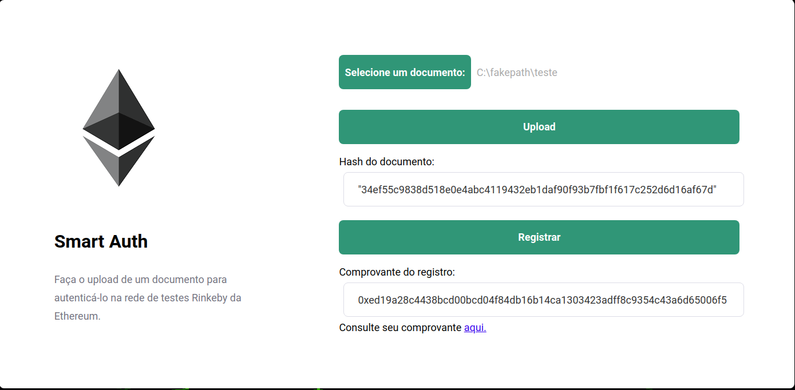

# Smart Auth

App developed by my hypothesis final paper of Information System degree.

The Smart Auth has as goal authenticate any digital file on the **RinkeBy** testing Blockchain of the **Ethereum** cryptocurrency.

The solution consists in extracting the *hash* of the document to later be sent to the Blockchain through a *smart contract*.



### Prerequirements

```
Go-ethereum/Geth
Truffle.js
web3.js
```

## Built with

* Node.js
* ReactJS
* Axios

## Author

Rafael Rodrigues
